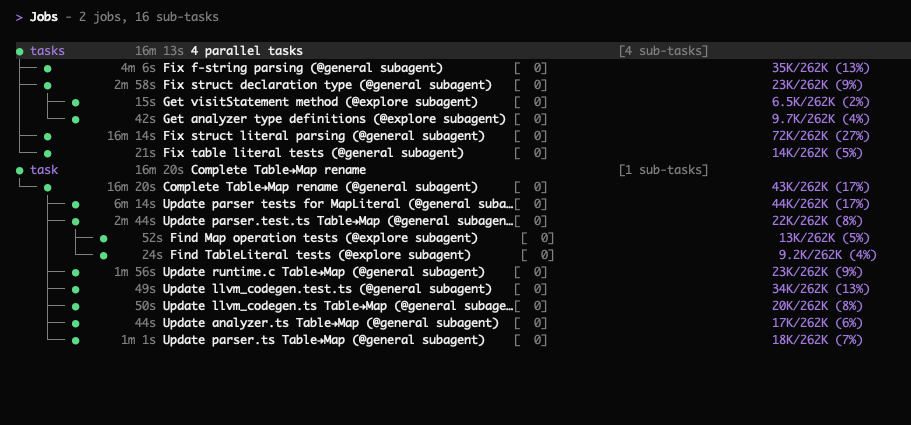

# Volt

**A terminal-based AI coding agent with Lossless Context Management.**

This is a research preview from Voltropy. For full details, read the [LCM technical paper](https://papers.voltropy.com/LCM).

---

## What is Volt?

Volt is an open-source AI coding agent that introduces **Lossless Context Management (LCM)**, a deterministic architecture for LLM memory that outperforms frontier coding agents on long-context tasks. In practice, this means:

- **No compaction delays** — context compression happens asynchronously between turns, so you never wait for it
- **No forgetting** — every message is saved in an immutable store and can be retrieved losslessly, no matter how long the session runs
- **Infinite sessions** — keep any session going indefinitely; there is no point at which the system forces you to start over
- **Purpose-built data tools** — process large volumes of information (classification, extraction, analysis) via parallel operators that never load the full dataset into context

The effective context window of Large Language Models remains the primary bottleneck for complex, long-horizon agentic tasks. Even models with 1M+ token windows are insufficient for multi-day agentic sessions, where the volume of tool calls, file contents, and intermediate reasoning can exceed the context limit of any production LLM. This problem is compounded by "context rot," in which model performance degrades well before the nominal limit is reached.

LCM addresses this by shifting the burden of memory architecture from the model back to the engine. Rather than asking the model to invent a memory strategy, LCM provides a deterministic, database-backed infrastructure. It maintains a high-fanout DAG of summaries in a persistent, transactional store, allowing the system to compress context aggressively while retaining "lossless" pointers to the original data. This ensures that any message from earlier in a session can always be retrieved, regardless of how many rounds of compaction have occurred.

### How LCM Works

LCM achieves lossless retrievability via a dual-state memory architecture:

- **Immutable Store** — The source of truth. Every user message, assistant response, and tool result produced during a session is persisted verbatim and never modified.
- **Active Context** — The window actually sent to the LLM on each turn. It is assembled from a mix of recent raw messages and precomputed _summary nodes_ — compressed representations derived from older messages via LLM summarization. Summary nodes function as materialized views over the immutable history: they are a cache, not a source of truth.

The core data structure is a Directed Acyclic Graph (DAG) maintained in a persistent store that supports transactional writes, foreign-key integrity, and indexed search. As the active context window fills, older messages are not discarded. Instead, they are compacted into **Summary Nodes** and the originals are saved.

To ensure reliability, LCM does not rely on the model to decide when to summarize. Instead, it employs a deterministic control loop driven by soft and hard token thresholds. Below the soft threshold, no summarization occurs and the user experiences the raw latency of the base model. When the soft threshold is exceeded, LCM performs compaction asynchronously and atomically swaps the resulting summary into the context between LLM turns. If a summarization level fails to reduce token count, the system automatically escalates to a more aggressive strategy via a **Three-Level Escalation** protocol, culminating in a deterministic fallback that requires no LLM inference. This guarantees convergence.

### Dolt Retrieval Traversal (Hook Pointer -> Bindle/Stub -> Expansion)

Dolt retrieval uses explicit lineage pointers so archived memory is traversable without guesswork:

- **Pre-response hooks** inject top memory cues with summary IDs, summary type metadata, and lineage pointer IDs.
- Cues may reference an active **bindle** or an archived **archive_stub** pointer.
- **lcm_describe** surfaces lineage metadata (type/level, off-context status, pointer targets, lineage closure IDs) so an agent can pick the correct node to traverse.
- **lcm_expand** then follows the lineage (including archive pointers) and expands to the underlying original messages.

This preserves the actual retrieval path end to end: hook pointer -> bindle/stub -> expanded content.

### Operator-Level Recursion

As an alternative to model-generated loops, LCM introduces **Operator-Level Recursion** via tools like `LLM-Map` and `Agentic-Map`. Instead of the model writing a loop, it invokes a single tool call. The engine — not the probabilistic model — handles the iteration, concurrency, and retries. This moves the "control flow" logic from the stochastic layer to the deterministic layer, allowing a single tool call to process an unbounded number of inputs without the model ever needing to manage a loop or context window.

- **LLM-Map** processes each item in a JSONL input file by dispatching it as an independent LLM API call. The engine manages a worker pool (default concurrency 16), validates each response against a caller-supplied JSON Schema, and retries failed items with feedback from the validation error. Each per-item call is a pure function from input to structured output — no tools or side effects are available. Results are written to a JSONL output file and registered in the immutable store. This is appropriate for high-throughput, side-effect-free tasks such as classification, entity extraction, or scoring.

- **Agentic-Map** is similar, but spawns a full sub-agent session for each item rather than a single LLM call. Each sub-agent has access to tools — file reads, web fetches, code execution — and can perform multi-step reasoning. A `read_only` flag controls whether sub-agents may modify the filesystem. This is appropriate when per-item processing requires tool use or multi-turn reasoning that cannot be captured in a single prompt.

### Large File Handling

In agentic coding sessions, tool results frequently include file contents that individually approach or exceed the context limit. LCM addresses this by imposing a token threshold below which files are included in context normally, and above which files are never loaded into the active context. Instead, the engine stores the file externally and inserts a compact reference: a stable content-addressed ID, the file path, and a precomputed **Exploration Summary** generated by a type-aware dispatcher that selects an analysis strategy based on file type.

### Results

Volt with LCM achieves higher scores than Claude Code on the OOLONG long-context benchmark, including at every context length between 32K and 1M tokens, using Opus 4.6. The architecture-centric approach yields reliability and cost advantages for production aggregation workloads while adding zero overhead for short tasks.

For the full technical details, see the [LCM paper](https://papers.voltropy.com/LCM).

---

## About This Project

Volt is forked from [OpenCode](https://github.com/anomalyco/opencode) by [Anomaly](https://opencode.ai), an open-source, permissively licensed, provider-agnostic coding agent built on a TypeScript client/server architecture with a terminal UI. OpenCode was chosen as the basis for Volt because it is fully featured and supports multiple LLM providers. In Volt, the LCM engine handles user sessions, replacing OpenCode's default session management. Volt is released as an open-source research preview to enable reproducibility and to support further research on deterministic context management architectures.

---

### Installation

```bash
curl -fsSL https://www.voltropy.com/install | sh
```

#### Installation Directory

The install script respects the following priority order for the installation path:

1. `$VOLTCODE_INSTALL_DIR` - Custom installation directory
2. `$XDG_BIN_DIR` - XDG Base Directory Specification compliant path
3. `$HOME/bin` - Standard user binary directory (if exists or can be created)
4. `$HOME/.voltcode/bin` - Default fallback

```bash
# Examples
VOLTCODE_INSTALL_DIR=/usr/local/bin curl -fsSL https://www.voltropy.com/install | sh
XDG_BIN_DIR=$HOME/.local/bin curl -fsSL https://www.voltropy.com/install | sh
```

### Building From Source

Requires [Bun](https://bun.sh) 1.3+.

```bash
# Clone the repo
git clone https://github.com/voltropy/voltcode.git
cd voltcode

# Install dependencies
bun install

# Run the Volt TUI in development mode
bun dev

# Build a standalone executable (current platform only)
./packages/voltcode/script/build.ts --single

# Install it
cp dist/voltcode-$(uname -s | tr '[:upper:]' '[:lower:]')-$(uname -m | sed 's/aarch64/arm64/')/bin/volt ~/.voltcode/bin/volt
```

### Setup Guide

Volt has two independent "mode" axes. They control different things and are configured separately:

| Axis                 | Values            | What it controls                                                    | How to change                               |
| -------------------- | ----------------- | ------------------------------------------------------------------- | ------------------------------------------- |
| **Agent UI mode**    | `build` / `plan`  | Agent permissions in the TUI (read-write vs read-only)              | Press `Tab` in the TUI                      |
| **LCM runtime mode** | `dolt` / `upward` | How the context engine compresses and retrieves long-session memory | Set `VOLTCODE_LCM_MODE` env var and restart |

**Agent UI mode** is a TUI-level toggle — it has nothing to do with how memory works.
**LCM runtime mode** controls the compaction and retrieval engine under the hood. Both modes use the same immutable Postgres store; they differ in _how_ they compress old messages and whether archived memory is searchable.

### Agent UI Modes

Volt includes two built-in UI modes you can switch between with the `Tab` key. These are independent of the LCM runtime mode — changing the UI mode does not affect how context compaction works.

- **build** — Default mode with full access for development work
- **plan** — Read-only mode for analysis and code exploration
  - Denies file edits by default
  - Asks permission before running bash commands
  - Ideal for exploring unfamiliar codebases or planning changes

Volt also spawns **sub-agents** automatically when needed — for example, the **general** sub-agent handles complex searches and multistep tasks. You can invoke it explicitly with `@general` in messages.

#### 1) Configure Model Access

Volt will not be useful until a provider/model is configured.

Use one of these config files:

- Project-local: `./voltcode.json` or `./voltcode.jsonc`
- Global: `${XDG_CONFIG_HOME:-~/.config}/voltcode/voltcode.json`
- Optional extra config directory: `VOLTCODE_CONFIG_DIR` (typically contains another `voltcode.json`)

Config merge precedence (lowest -> highest):

1. Remote well-known config (if configured through auth)
2. Global config in `${XDG_CONFIG_HOME:-~/.config}/voltcode/`
3. `VOLTCODE_CONFIG` file path override
4. Project `voltcode.jsonc` / `voltcode.json` discovered upward from the working directory
5. `VOLTCODE_CONFIG_CONTENT` inline JSON

For this repository specifically, the default `bun dev` script runs with `--cwd packages/voltcode`, so `packages/voltcode/.env` is the environment file Bun loads first in local development.

Minimal example:

```json
{
  "$schema": "https://opencode.ai/config.json",
  "enabled_providers": ["openai"],
  "model": "openai/gpt-5",
  "small_model": "openai/gpt-5-mini"
}
```

Add provider credentials in your environment (for example: `OPENAI_API_KEY`, `ANTHROPIC_API_KEY`, etc.).

#### 2) Configure LCM Runtime Mode

Set the LCM runtime mode before starting Volt. The mode is read once at startup — changing it requires a restart.

**For local development** (using `bun dev`), edit `packages/voltcode/.env`:

```bash
cp packages/voltcode/.env.example packages/voltcode/.env
```

```env
# Copy packages/voltcode/.env.example -> packages/voltcode/.env
# Then pick one profile by setting mode:
VOLTCODE_LCM_MODE=upward
```

**For installed binary or CI**, export the variable in your shell:

```bash
export VOLTCODE_LCM_MODE=dolt   # or: upward
```

Default is `dolt` if unset. See "Dolt vs Upward" below for what each mode does.

#### 3) Pick Database Backend (Embedded vs External)

By default Volt uses embedded Postgres for LCM on `darwin/linux` and `x64/arm64`.

- Embedded defaults: host `127.0.0.1`, port `54329`, database `voltcode_lcm`, user `voltcode`.
- Embedded data/log paths: `${XDG_DATA_HOME:-~/.local/share}/voltcode/` (including downloaded Postgres binaries and LCM state).

To use external Postgres, set one of:

- `LCM_DATABASE_URL=postgres://...` (highest priority)
- Or `RDS_ENDPOINT`, `RDS_USERNAME`, `RDS_PASSWORD` (plus optional `RDS_PORT`, `RDS_DATABASE`)

#### 4) Run and Verify

```bash
# Start the TUI
bun dev

# Confirm which LCM mode will be used (mode is read from env at startup)
echo $VOLTCODE_LCM_MODE
# Expected: "dolt" (or "upward", or empty — empty means dolt by default)

# For local dev, check what packages/voltcode/.env has:
grep VOLTCODE_LCM_MODE packages/voltcode/.env

# Show the full resolved provider/agent config as JSON
# (Note: this prints Config.get(), which covers provider and agent-UI
# settings. LCM runtime mode is not part of this output — it is read
# separately from the VOLTCODE_LCM_MODE env var at startup.)
bun dev debug config

# Optional: watch live LCM lane token counts during a session
bun dev session lcm-watch
```

If the TUI starts in the wrong LCM mode, verify your env var is set in the right place (see step 2) and restart.

#### 5) Dolt vs Upward: How They Differ

Both modes use the same immutable Postgres store and the same summary DAG structure. They differ in compaction strategy and retrieval capability:

**Dolt** (default) compacts context by evicting the oldest top-level summary nodes (bindles) when the context window fills. Evicted bindles are archived with "ghost cue" pointers, so the agent can search and retrieve them on demand via the off-context retrieval adapter (`lcm_expand_query` candidate resolution, pre-response hook cues). This gives the agent the broadest possible recall at the cost of slightly larger metadata overhead.

**Upward** compacts context by recursively condensing summaries bottom-up at unbounded depth (d1 → d2 → d3 → dN, reusing the d3 prompt for all orders ≥ 3) without ever evicting bindles. This keeps all summaries on-context but the off-context retrieval adapter is disabled — `lcm_expand_query` will skip off-context candidates with an `off_context_unavailable` diagnostic, and pre-response hook cues will not surface evicted bindles (because none are evicted). Note that `lcm_grep` is unaffected by this limitation: it queries raw messages in the database directly and works identically in both modes. Upward is simpler and avoids ghost-cue overhead, but structured off-context recall is unavailable.

| Behavior                                                              | `dolt`                                           | `upward`                                                   |
| --------------------------------------------------------------------- | ------------------------------------------------ | ---------------------------------------------------------- |
| Compaction approach                                                   | Evict oldest bindles when over budget            | Recursively condense summaries bottom-up (unbounded depth) |
| Off-context retrieval adapter (`lcm_expand_query`, pre-response cues) | Available — evicted bindles are searchable       | Disabled — returns `off_context_unavailable` diagnostic    |
| `lcm_grep` (raw message search)                                       | Works                                            | Works (not mode-gated)                                     |
| Ghost cue archival                                                    | Enabled — evicted bindles leave lineage pointers | Disabled                                                   |
| Manual `/compact`                                                     | Creates one new bindle from oldest leaves        | Forces full recursive condensation pass                    |
| Bindle eviction                                                       | Yes (max 1 per compaction cycle)                 | Never                                                      |

**Which to choose:** Use `dolt` if you want the agent to be able to recall anything from any point in a long session. Use `upward` if you prefer a simpler compaction model and don't need retroactive search over archived context.

#### 6) LCM Tooling: Which Tool for Which ID

Use the right tool for the right ID type:

- `file_xxx`: use `lcm_read` (from an explore sub-agent) for actual content, and `lcm_describe` for metadata.
- `sum_xxx`: use `lcm_expand_query` for focused deep recall, `lcm_expand` via sub-agent for low-level expansion, and `lcm_describe` to inspect lineage first.

Fast recall helper:

- `lcm_grep` performs regex search over conversation messages (including messages no longer in active context), with optional `summary_id` scoping.

#### 7) Key LCM Environment Variables

Use one profile at a time. `packages/voltcode/.env.example` includes both profiles with comments and defaults.

Shared runtime controls (both profiles):

- `VOLTCODE_LCM_DEFAULT_CTX_CUTOFF_THRESHOLD`
- `VOLTCODE_LCM_TARGET_FREE_PERCENTAGE`
- `VOLTCODE_LCM_MIN_MESSAGES_TO_SUMMARIZE`
- `VOLTCODE_LCM_MIN_PROTECTED_TAIL_LEAVES`
- `VOLTCODE_LCM_CRITICAL_THRESHOLD_MULTIPLIER`
- `VOLTCODE_LCM_MAX_COMPACTION_ROUNDS`
- `VOLTCODE_LCM_SUMMARY_MAX_OUTPUT_TOKENS`
- `VOLTCODE_LCM_CONDENSE_MAX_OUTPUT_TOKENS`

Use these variables for Dolt:

- `VOLTCODE_LCM_MODE=dolt`
- `VOLTCODE_LCM_DOLT_LEAVES_*`
- `VOLTCODE_LCM_DOLT_SPRIGS_*`
- `VOLTCODE_LCM_DOLT_BINDLES_*`
- `VOLTCODE_LCM_DOLT_HARD_LIMIT_RISK_BUFFER`
- `VOLTCODE_LCM_DOLT_GHOST_CUE_ARCHIVE_ENABLED`
- `VOLTCODE_LCM_RETRIEVAL_*`
- `VOLTCODE_LCM_PRE_RESPONSE_HOOK_*`

Use these variables for Upward:

- `VOLTCODE_LCM_MODE=upward`
- `VOLTCODE_LCM_UPWARD_CONTEXT_THRESHOLD`
- `VOLTCODE_LCM_UPWARD_FRESH_TAIL_COUNT`
- `VOLTCODE_LCM_UPWARD_LEAF_CHUNK_TOKENS`
- `VOLTCODE_LCM_UPWARD_LEAF_MIN_FANOUT`
- `VOLTCODE_LCM_UPWARD_CONDENSED_MIN_FANOUT`
- `VOLTCODE_LCM_UPWARD_CONDENSED_MIN_FANOUT_HARD`
- `VOLTCODE_LCM_UPWARD_CONDENSED_TARGET_TOKENS`

#### 8) Troubleshooting

- `VOLTCODE_LCM_MODE must be one of: dolt, upward`: your mode value is invalid.
- `off_context_unavailable` diagnostics in Upward mode: expected behavior; Upward cannot search off-context archived summaries.
- `LCM unavailable: embedded postgres unsupported on platform`: use external Postgres via `LCM_DATABASE_URL` (or `RDS_*`).
- Unsure what provider/agent config loaded: run `bun dev debug config` and inspect the merged output (note: LCM mode is not in this output — check `VOLTCODE_LCM_MODE` in your environment or `.env` file).

### Task Tree

When Volt spawns sub-agents or parallel operators, the TUI displays a live **task tree** showing the hierarchy of active and completed work. This gives you visibility into what the agent is doing at each level of delegation — which sub-agents are running, what they've been asked to do, and whether they've finished.



### Documentation

> **Note:** The links below point to OpenCode's documentation. Volt is a fork of OpenCode and we have tried to maintain compatibility, but we make no guarantees of full compatibility. Some features or configuration options may differ.

- [Full documentation](https://opencode.ai/docs) (OpenCode)
